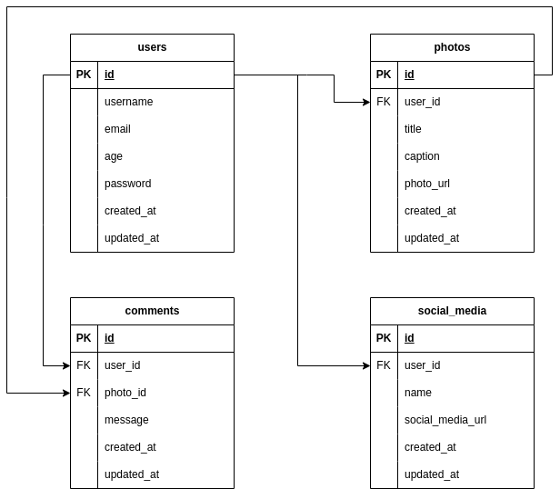

# Final Project 2 - MyGram App

This is the Final Project 2 of Kampus Merdeka in collaboration with Hacktiv8. For this final project, we were tasked with developing an application called MyGram. This application comprises four main domains: users, photos, comments, and social media.

# Group 5 - GLNG-KS07
- Januwar By Khaqi
- Yasid Al Mubarok
- Yusril Ilham Kholid

# Demo

- [API](https://final-project-2-mygram-app-production.up.railway.app)
- [Swagger](https://final-project-2-mygram-app-production.up.railway.app/swagger/index.html)
- [Postman](https://documenter.getpostman.com/view/25929560/2s9YJhvz17)

# Tech Stack
- [Go](https://go.dev/)
- [Gin-gonic](https://gin-gonic.com/)
- [Govalidator](https://github.com/asaskevich/govalidator)
- [Jwt-go](https://github.com/golang-jwt/jwt)
- [Testify](https://github.com/stretchr/testify)
- [Crypto](https://pkg.go.dev/crypto)
- [Swagger Documentation](https://github.com/swaggo)
- [Postgres Driver](https://pkg.go.dev/github.com/lib/pq)
- [PostgreSQL](https://www.postgresql.org/)

# Database Relation

# Schema
| Domain       | Method   | Endpoint                     | Middleware                     | Description          |
|--------------|----------|------------------------------|--------------------------------|----------------------|
| Users        | POST     | /users/register              | -                              | User register        |
| Users        | POST     | /users/login                 | -                              | User login           |
| Users        | PUT      | /users/                      | Authentication                 | User update          |
| Users        | DELETE   | /users/                      | Authentication                 | User delete          |
| Photos       | POST     | /photos/                     | Authentication                 | Add Photo            |
| Photos       | GET      | /photos/                     | Authentication                 | Get Photos           |
| Photos       | PUT      | /photos/:photoId             | Authentication & Authorization | Update Photos        |
| Photos       | DELETE   | /photos/:photoId             | Authentication & Authorization | Delete Photo         |
| Comment      | POST     | /comment/                    | Authentication                 | Add Comment          |
| Comment      | GET      | /comment/                    | Authentication                 | Get Comments         |
| Comment      | PUT      | /comment/:commentId          | Authentication & Authorization | Update Comment       |
| Comment      | DELETE   | /comment/:commentId          | Authentication & Authorization | Delete Comment       |
| Social Media | POST     | /socialmedis/                | Authentication                 | Add Social Media     |
| Social Media | GET      | /socialmedis/                | Authentication                 | Get Social Medias    |
| Social Media | PUT      | /socialmedis/:socialMediaId  | Authentication & Authorization | Update Social Media  |
| Social Media | DELETE   | /socialmedis/:socialMediaId  | Authentication & Authorization | Delete Social Media  |

# Swagger UI

## Comment

## Social Media and Photos

## Users

